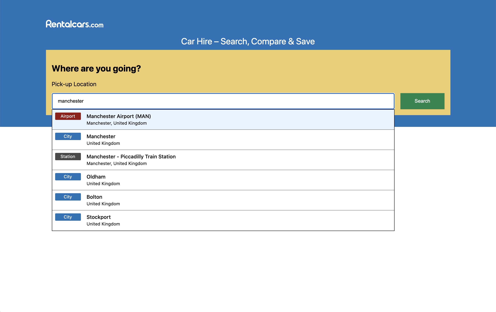

## How to run the App

1. ### Install Dependencies

```bash
npm install
# or
yarn
```

2. ### Build and Run

#### To run Production build:

```bash
npm run build && npm run start
# or
yarn build && yarn start
```

<i>FYI You can also run a production build inside a docker container by running: `make build`</i>

#### To run Development server:

```bash
npm run dev
# or
yarn dev
```

3. ### Hit Endpoint

Open [http://localhost:3000](http://localhost:3000) with your browser to see the result!!

## How to run the unit tests

```bash
npm run test
# or
yarn test
```
